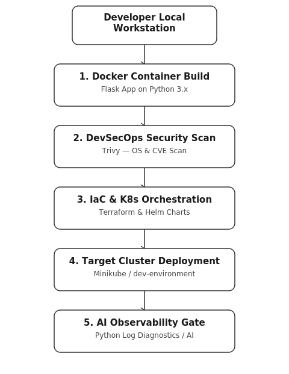

# 🚀 DevSecOps Local Pipeline with AIOps Log Diagnostics

An end-to-end, shift-left DevSecOps automation pipeline designed to run locally on **macOS (16 GB RAM)** with **$0 cloud infrastructure costs**. This project demonstrates automated containerization, security vulnerability gating, Infrastructure as Code (IaC), Helm chart deployment, and AIOps automated incident log analysis using Google's Gemini API.

---

## 📐 Pipeline Architecture



```text
[ Developer Workstation (macOS) ]
               │
               ▼
[ 1. Docker Container Build ]      ──► Multi-stage non-root Python Flask App
               │
               ▼
[ 2. DevSecOps Security Scan ]     ──► Trivy OS & Python Dependency Vulnerability Scan
               │
               ▼
[ 3. IaC & K8s Orchestration ]     ──► Terraform (Namespace) & Helm (Deployment Specs)
               │
               ▼
[ 4. Target Cluster Deployment ]   ──► Minikube (dev-environment namespace)
               │
               ▼
[ 5. AI Observability Gate ]       ──► Python kubectl Log Tailing + Gemini LLM Diagnostics
